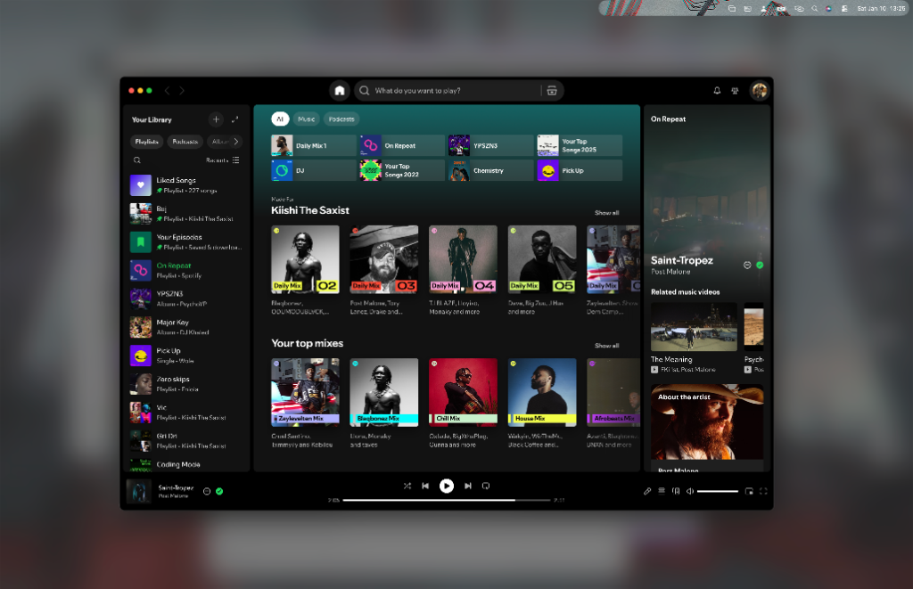
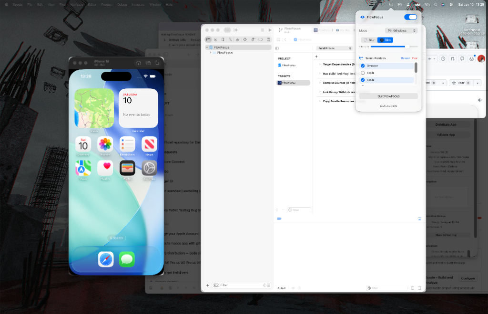

<p align="center">
  
</p>

<h1 align="center">FlowFocus</h1>

<p align="center">
  <strong>Eliminate distractions. Amplify focus.</strong>
</p>

<p align="center">
  A beautiful macOS menu bar app that blurs or dims background windows, <br>
  keeping your attention where it belongs.
</p>

<p align="center">
  
  
  
</p>

---

## Features

- **Blur Mode** — Applies a premium frosted-glass effect to unfocused windows
- **Dim Mode** — Darkens background windows with adjustable opacity
- **Three Focus Modes:**
  - **Single Window** — Focus follows your active window automatically
  - **Pin Windows** — Manually select specific windows to keep visible
  - **Current App** — Show all windows from the focused application
- **Smooth Animations** — Fluid transitions that feel native to macOS
- **Lives in Menu Bar** — Unobtrusive, always accessible

---

## Keyboard Shortcuts

| Shortcut | Action |
|----------|--------|
| `⌃ ⌥ ⌘ F` | Turn FlowFocus on / off |
| `⌃ ⌥ ⌘ ,` | Open settings |
| `⌃ ⌥ ⌘ Esc` | Clear all pins |

---

## Preview

<p align="center">
  
</p>
<p align="center"><em>Blur mode in action — focused window stays crystal clear while distractions fade away</em></p>

<p align="center">
  
</p>
<p align="center"><em>Clean settings popover with window pinning — accessible from the menu bar</em></p>

---

## Installation

### Direct Download

1. Download the latest release from the [Releases](../../releases) page
2. Move `FlowFocus.app` to your Applications folder
3. Launch FlowFocus and grant Accessibility permissions when prompted

### Build from Source

```bash
# Clone the repository
git clone https://github.com/yourusername/FlowFocus.git
cd FlowFocus

# Open in Xcode
open FlowFocus.xcodeproj

# Build and run (Command + R)
```

**Requirements:**
- macOS 13.0 (Ventura) or later
- Xcode 15.0+ (for building from source)

---

## Permissions

FlowFocus requires **Accessibility permissions** to:
- Detect which window is currently focused
- Read window positions for the overlay effect

On first launch, you'll be prompted to grant access in **System Settings > Privacy & Security > Accessibility**.

---

## How It Works

FlowFocus creates a transparent overlay that covers your entire screen, then "cuts out" holes where your focused windows are. The overlay can either:

1. **Blur** — Uses macOS's native `NSVisualEffectView` for a beautiful frosted-glass look
2. **Dim** — Applies a semi-transparent black layer with adjustable opacity

The overlay is click-through, so you can interact with any window naturally — FlowFocus just makes the unfocused ones fade into the background.

---

## Contributing

Contributions are welcome! Feel free to:

1. Fork the repository
2. Create a feature branch (`git checkout -b feature/amazing-feature`)
3. Commit your changes (`git commit -m 'Add amazing feature'`)
4. Push to the branch (`git push origin feature/amazing-feature`)
5. Open a Pull Request

---

## License

This project is licensed under the MIT License — see the [LICENSE](LICENSE) file for details.

---

<p align="center">
  Made by <b>Kiishi</b>
</p>
